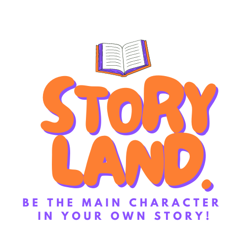

# StoryLand

StoryLand is an innovative web application that aims to provide an engaging and personalized storytelling experience for children aged 5 to 10. By combining the power of React.js and the OpenAI API, StoryLand dynamically generates captivating stories with high-quality illustrations, tailored to each child's unique prompts.

## Screenshots

_The welcome page - kid can type their name_

_Kid can type in what story topic they want to explore_

_Generated story content Part I_

_Generated story content Part II_

## How it Works

StoryLand operates by allowing children to input prompts or preferences, such as character names, favorite places, or desired adventures. The application then uses the OpenAI API to generate a unique and captivating story, integrating the provided prompts seamlessly into the narrative. High-quality illustrations are incorporated, bringing the story to life and captivating the young readers.

## Getting Started

To run StoryLand locally on your machine, follow these steps:

1. Clone this repository.
2. Navigate to the project directory.
3. Install dependencies by running `npm install`.
4. Obtain an API key from OpenAI and set it in the appropriate environment variable.
5. Start the development server with `npm run dev`.
6. Access the application in your web browser at `http://localhost:3000`.

## License

StoryLand is released under the [MIT License](/path/to/license).
